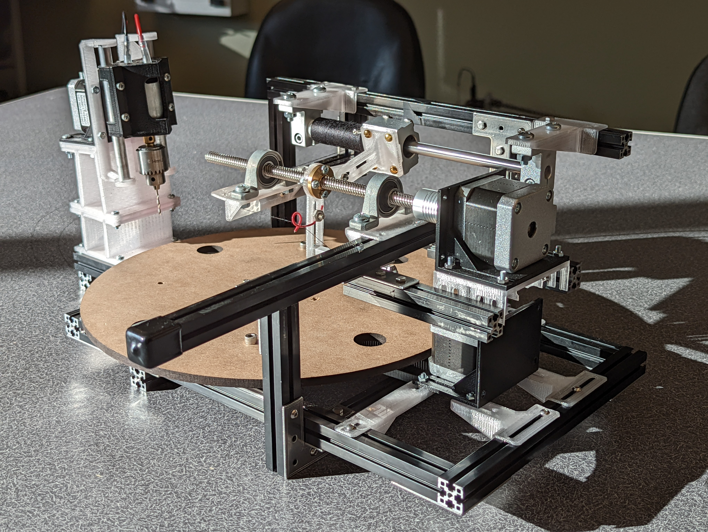
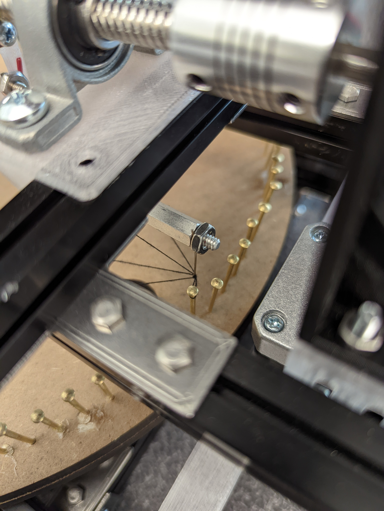
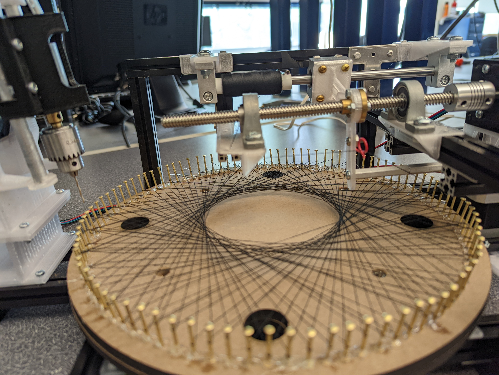

<!---











-->

<p align="center">
  
</p>

<div align="center">
<h1>String Art Machine</h1>
<p>By: Ahkar Kyaw, Elvis Tang</p>
  
<!--- Comment out
<p>Cal Poly Spring 2022, ME405 Term Project</p>
<p>Report Date: 6/10/2022</p>
--->
  
</div>

<div align="left">
<!--- Comment out
<p><strong>Lab Group:</strong> Mecha 16</p>
<p><strong>Authors:</strong> Ahkar Kyaw, Elvis Tang</p>
<p><strong>Instructor's Name: </strong> Charlie Refvem </p>
--->
</div>

<br></br>
<br></br>

# Introduction
Text

|  |  |
| ----------------- |:----------------:|
| left foo          | right foo        |


# Hardware Components
| **Components** | **vender**     | **Dimension** |
| :-----------:  | :-----------: | :-----------: |
| MDF board | [Amazon](https://www.amazon.com/dp/B07QWSTMWJ?ref_=cm_sw_r_cp_ud_dp_WGG48NSVNE196GH4DMZJ) | 14-in(L) x 11-in(W) x 0.25-in(T)|
| Nails | [Amazon](https://www.amazon.com/Projects-Antique-Repairing-Decorative-Accessories/dp/B082J2JXZD?tag=cf09c0-20&geniuslink=true&th=1) | 23mm(L) |
| String | [Amazon](https://www.amazon.com/dp/B07LC1YDVR?ref_=cm_sw_r_cp_ud_dp_Z0H458M8TY3VP6MC05YG) | 200m |
| 80/20 Aluminum Extrusion | [McMASTER-CARR](https://www.mcmaster.com/80//t-slotted-framing-rails/) | 20mm x 20mm |
| T8 Lead Screw Nut Set | [Amazon](https://www.amazon.com/dp/B07GV72326?ref_=cm_sw_r_cp_ud_dp_XBR2BX6C1A7YK6SPVKN0) | 200mm(L), 8mm(D) |

<!--- comment out
* 14-in x 11-in MDF board ......... [Amazon](https://www.amazon.com/dp/B07QWSTMWJ?ref_=cm_sw_r_cp_ud_dp_WGG48NSVNE196GH4DMZJ).
* Mini 12V Hand Drill ......... [Amazon](https://www.amazon.com/AUTOTOOLHOME-Electric-Drill-Motor-Drills/dp/B01LZYWFE4/ref=asc_df_B01LZYWFE4/?tag=hyprod-20&linkCode=df0&hvadid=309735728871&hvpos=&hvnetw=g&hvrand=12073945360090893366&hvpone=&hvptwo=&hvqmt=&hvdev=c&hvdvcmdl=&hvlocint=&hvlocphy=1014232&hvtargid=pla-461591041401&psc=1).
* NEMA 17 Stepper Motor ....... [Amazon](https://www.amazon.com/dp/B07QV1ZVJR?tag=rpantiques-20&linkCode=ogi&th=1).
* Nails ......... [Amazon](https://www.amazon.com/Projects-Antique-Repairing-Decorative-Accessories/dp/B082J2JXZD?tag=cf09c0-20&geniuslink=true&th=1).
* String ......... [Amazon](https://www.amazon.com/dp/B07LC1YDVR?ref_=cm_sw_r_cp_ud_dp_Z0H458M8TY3VP6MC05YG).
* 80/20 Aluminum Extrusion ......... [McMASTER-CARR](). --->

# Electronic Components
| **Components** | **Vender** | **Datasheet**  |
| :-----------:  | :-----------: | :----------- |
| NUCLEO (STM32L476RG) | [MOUSER](https://www.mouser.com/ProductDetail/STMicroelectronics/NUCLEO-L476RG?qs=PRtH0mD6DWbM6mRV5DKjBQ%3D%3D) | https://www.st.com/resource/en/datasheet/stm32l476rg.pdf |
| Shoe of Brian | [OSHPARK](https://oshpark.com/shared_projects/e6X6OnYK) |  http://wind.calpoly.edu/ME405/doc/shoe_info.html |
| Mini 12V Hand Drill | [Amazon](https://www.amazon.com/AUTOTOOLHOME-Electric-Drill-Motor-Drills/dp/B01LZYWFE4/ref=asc_df_B01LZYWFE4/?tag=hyprod-20&linkCode=df0&hvadid=309735728871&hvpos=&hvnetw=g&hvrand=12073945360090893366&hvpone=&hvptwo=&hvqmt=&hvdev=c&hvdvcmdl=&hvlocint=&hvlocphy=1014232&hvtargid=pla-461591041401&psc=1)|  |
| NEMA 17 Stepper Motor | [Amazon](https://www.amazon.com/dp/B07QV1ZVJR?tag=rpantiques-20&linkCode=ogi&th=1) | http://www.autoflexible.com/file_upload/product/attach/NEMA%2017.pdf |
| LCD 1602 (I2C port) | [Amazon](https://www.amazon.com/dp/B019K5X53O?ref_=cm_sw_r_cp_ud_dp_NDRGXARM7KG02A7N59Y2) | http://www.handsontec.com/dataspecs/module/I2C_1602_LCD.pdf |
| TMC4210 | [MOUSER](https://www.mouser.com/ProductDetail/Trinamic/TMC4210-I?qs=TiOZkKH1s2TH5TqjeGBn1g%3D%3D) | https://www.trinamic.com/fileadmin/assets/Products/ICs_Documents/TMC4210_Datasheet_Rev.1.06.pdf |
| TMC2208 | [Amazon](https://www.amazon.com/Printer-TMC2208-Screwdriver-Controller-Ramps1-4/dp/B082LSQWZF/ref=sr_1_3?keywords=tmc2208&qid=1654876252&sr=8-3) | https://www.trinamic.com/fileadmin/assets/Products/ICs_Documents/TMC220x_TMC2224_datasheet_Rev1.09.pdf |

# manufacturing / Machining Tools
| **Tool** | Source Files |
| :-----------:  | :-----------:  |
| 3D printer | [CAD](https://github.com/AhKyaw/ME405_StringArt/tree/main/CAD%20Files/3D%20Printing) |
| Laser Cutter | [CAD](https://github.com/AhKyaw/ME405_StringArt/tree/main/CAD%20Files/Laser%20Cutting)  |
<!--- comment out
* 3D printer
* Laser Cutter
* Item 2a
* Item 2b  --->

# Hardware Design
Text

# Software Design
Text

# Drilling


# Nailing

# Looping
## Without Interference


## Mechanism


## Challenges


## With Interference 


# Hardware
Text

# Software
Text

# Challenges
Text


## Program

```
let message = 'Hello world';
alert(message);
```

# Markdown Reference

# This is a Heading h1
## This is a Heading h2 
###### This is a Heading h6

*This text will be italic*  
_This will also be italic_

**This text will be bold**  
__This will also be bold__

_You **can** combine them_

* Item 1
* Item 2
* Item 2a
* Item 2b

1. Item 1
1. Item 2
1. Item 3
  1. Item 3a
  1. Item 3b

## Images


https://drive.google.com/file/d/1LtbPpOibTKHI9eM-5CNW1QeBWgA9KlBs/view?usp=sharing

## Links

You may be using [Markdown Live Preview](https://markdownlivepreview.com/).


## Blockquotes

> Markdown is a lightweight markup language with plain-text-formatting syntax, created in 2004 by John Gruber with Aaron Swartz.
>
>> Markdown is often used to format readme files, for writing messages in online discussion forums, and to create rich text using a plain text editor.

## Inline code

This web site is using `markedjs/marked`.
